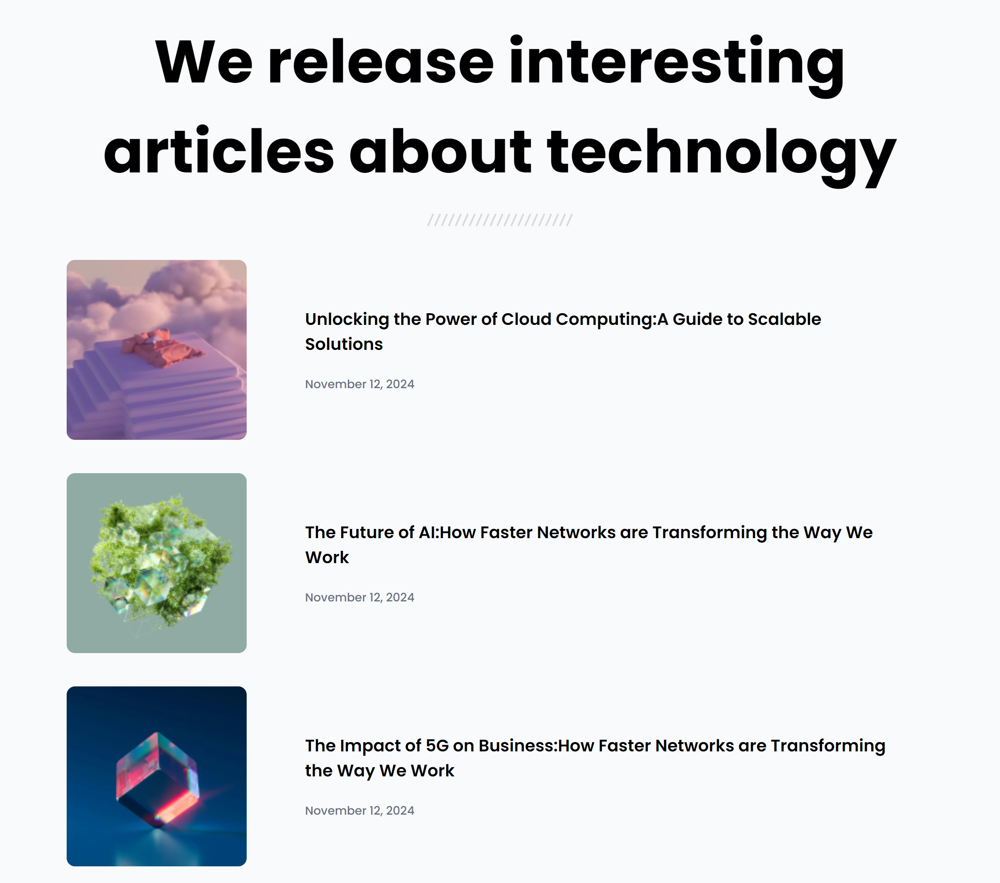

# Listado de Artículos sobre Tecnología

Este es un proyecto de listado simple de artículos sobre tecnología, creado con **HTML** y **CSS**. El objetivo de este proyecto es mostrar una lista de artículos con imágenes y descripciones breves, optimizado para diferentes tamaños de pantalla.

## Características

- **Interfaz amigable**: Presenta artículos con imágenes y descripciones breves.
- **Responsive Design**: El diseño se adapta a diferentes tamaños de pantalla, desde dispositivos móviles hasta monitores de escritorio.
- **Optimización para SEO**: Incluye metadatos y buenas prácticas para mejorar la visibilidad en motores de búsqueda.
- **Imágenes interactivas**: Las imágenes de los artículos cambian de tamaño al pasar el cursor por encima.

## Tecnologías Utilizadas

- **HTML**: Para la estructura de la página.
- **CSS**: Para el estilo y diseño visual del sitio.
- **Google Fonts**: Para la tipografía.

## Vista Previa del Proyecto



## Cómo Ejecutarlo Localmente

1. Clona el repositorio:
    ```bash
    git clone https://github.com/tu-usuario/nombre-del-repositorio.git
    ```
2. Navega a la carpeta del proyecto:
    ```bash
    cd nombre-del-repositorio
    ```
3. Abre el archivo `index.html` en tu navegador.

## Estructura del Proyecto

```bash
/
├── index.html
├── style.css
├── img/
└── README.md

